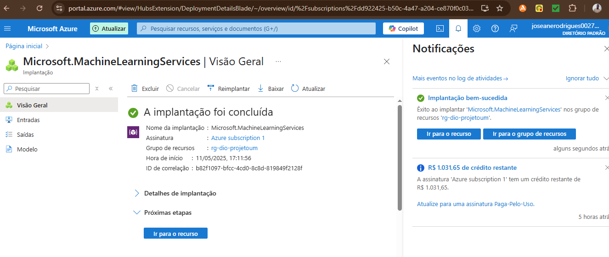
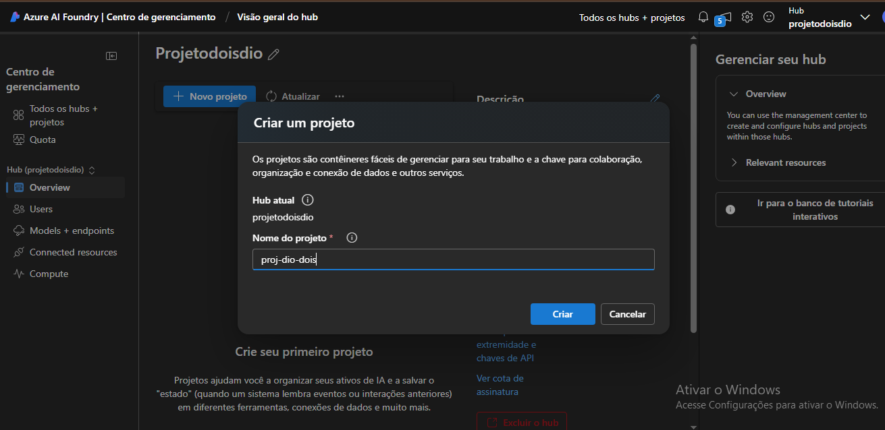
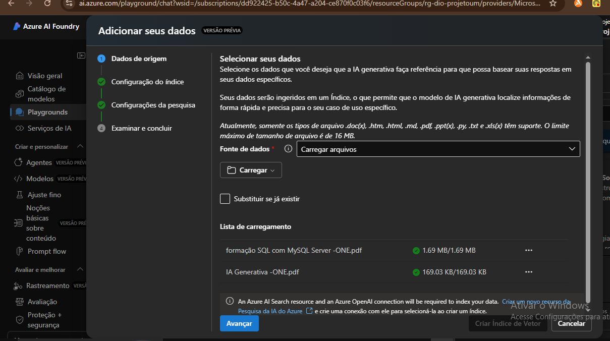
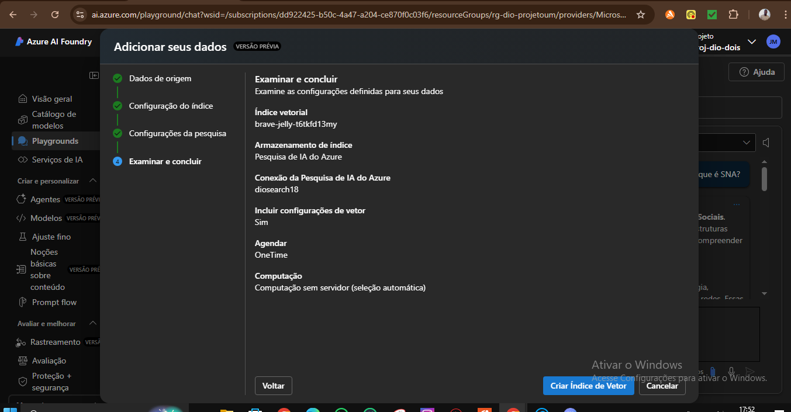
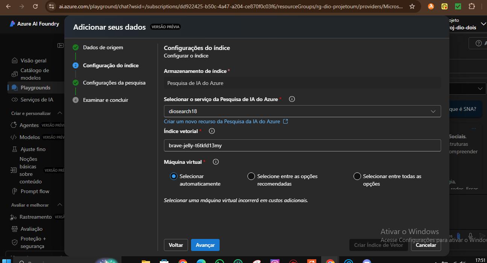
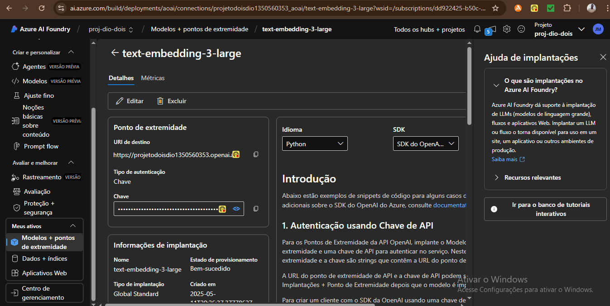
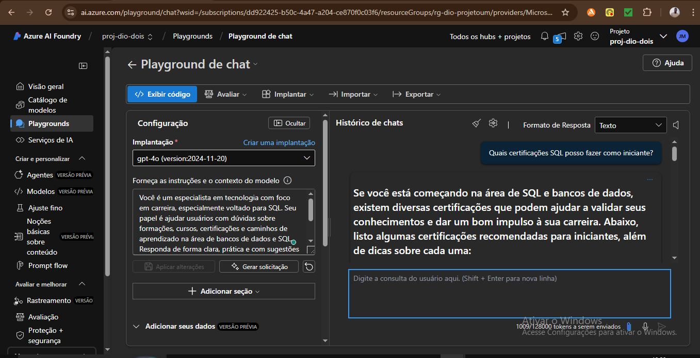

# 🤖 Chatbot com PDFs usando Azure AI Studio

Este projeto foi desenvolvido como parte do desafio da DIO, com o objetivo de criar um chatbot que responde perguntas com base em conteúdo de arquivos PDF usando IA generativa e busca vetorial.

---

## 🚀 Objetivos do Projeto

- ✅ Carregar arquivos PDF contendo conteúdo técnico

- ✅ Criar índice vetorial com Azure Cognitive Search

- ✅ Implementar modelo de embeddings (`text-embedding-3-large`)

- ✅ Implantar LLM (`gpt-4o`) para gerar respostas baseadas nos dados

- ✅ Criar um Playground funcional com base nos PDFs

---

## 🧠 Tecnologias Utilizadas

- **Azure AI Studio**

- **Azure Cognitive Search**

- **GPT-4o (Azure OpenAI)**

- **text-embedding-3-large**

- **PDFs de entrada com conteúdo técnico (SQL e IA Generativa)**

---

## 🗂️ Arquivos PDF usados

- 📄 `formação SQL com MySQL Server - ONE.pdf`

- 📄 `IA Generativa - ONE.pdf`

Esses arquivos estão na pasta `inputs/`.

---

## 🖼️ Prints do Projeto

### 🔧 Etapas do projeto no Azure AI Studio

1. Criação do Hub e Projeto  
     

   

3. Upload dos arquivos PDF  
   

4. Criação do índice vetorial  
   

5. Conexão com Azure Cognitive Search  
   

6. Implantação dos modelos  
     
   

7. Testando o chatbot no Playground  
   

---

## 🧪 Como funciona

Após carregar os PDFs e criar o índice vetorial, o Azure AI utiliza embeddings para entender o conteúdo e o `gpt-4o` para responder às perguntas feitas no Playground. A resposta é gerada **com base apenas no conteúdo dos arquivos carregados**, simulando um assistente personalizado.

---

## ✨ Aprendizados

- Como usar busca vetorial com Azure Cognitive Search

- Como subir e indexar documentos personalizados

- Implantar e utilizar modelos do Azure OpenAI

- Criar um chat inteligente baseado em documentos específicos

---

